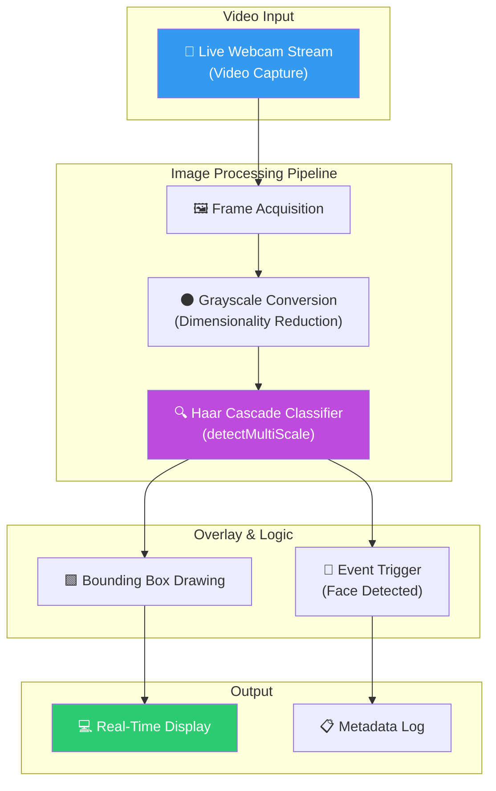
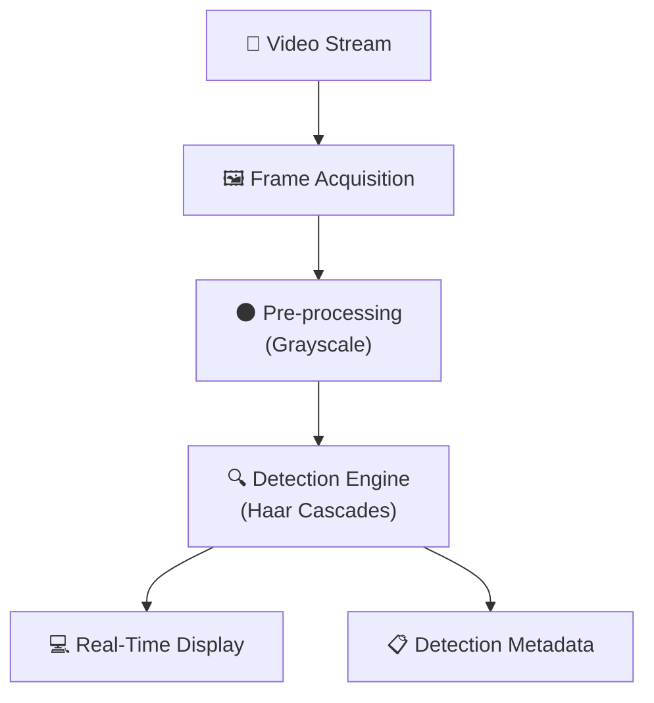

# 👁️ SmartLens: Enterprise Real-Time Computer Vision & Edge Intelligence

<p align="center">
  
  
  
  
  
</p>

**SmartLens** è un sistema di Computer Vision (CV) ad alte prestazioni progettato per il rilevamento facciale in tempo reale. Il progetto implementa algoritmi di analisi d'immagine ottimizzati per operare su stream video live, garantendo bassa latenza e alta efficienza computazionale. L'architettura è ideale per l'integrazione in dispositivi Edge, sistemi di sicurezza fisica e soluzioni di Smart Retail dove la velocità di risposta è critica.

## 🏢 Valore Enterprise & Settori di Applicazione

| Settore / Ambito | Rilevanza & Benefici |
|-------------------|-----------|
| **Physical Security & Access Control** | Monitoraggio degli accessi in tempo reale e automazione dei varchi tramite rilevamento biometrico preliminare. |
| **Smart Retail & Analytics** | Analisi del traffico pedonale, heatmap di permanenza e customer engagement basato sulla presenza fisica. |
| **Human-Computer Interaction (HCI)** | Sviluppo di interfacce interattive che reagiscono alla presenza dell'utente (es. chioschi digitali, smart signage). |
| **Edge & IoT Infrastructure** | Elaborazione d'immagine on-device per ridurre il consumo di banda e i costi di storage cloud (Privacy-by-Design). |

---

## 🎯 Executive Summary & Valore di Business
SmartLens risolve la sfida dell'elaborazione d'immagine ad alta frequenza su hardware non dedicato, offrendo un sistema di detection robusto e scalabile.

### 🏛️ 1. Real-Time Processing Pipeline
* **Bassa Latenza:** Ottimizzazione del ciclo di acquisizione frame (`cv2.VideoCapture`) per garantire un'esperienza fluida anche su dispositivi consumer o embedded (es. Raspberry Pi).
* **Pre-processing Efficiente:** Conversione automatica in scala di grigi per abbattere la complessità computazionale del rilevamento senza perdere le feature morfologiche essenziali del volto.

### ⚙️ 2. Haar Cascade Optimization
* **Parametric Tuning:** Utilizzo di classificatori pre-addestrati Haar Cascade con tuning accurato dei parametri `scaleFactor` e `minNeighbors` per bilanciare la precisione (minimizzazione falsi positivi) e la sensibilità del rilevamento.
* **Spatial Detection:** Calcolo dinamico dei bounding box con sovrapposizione grafica istantanea, fornendo un feedback visivo immediato per l'utente o i sistemi di monitoraggio.

### 🛡️ 3. Privacy & Governance
* **On-Edge Processing:** Il sistema è progettato per elaborare i dati localmente. Le immagini possono essere analizzate e scartate immediatamente, inviando solo i metadati di rilevamento ai sistemi centrali, in piena conformità con le normative GDPR.

---

## 🏗️ Architettura del Ciclo di Processing



## 🛠️ Stack Tecnologico

| Layer | Tecnologia | Ruolo |
|:------|:-----------|:-----|
| 🐍 **Language** | Python 3.8+ | Core development |
| 👁️ **CV Library** | OpenCV 4.x | Computer Vision Framework |
| 🧠 **Algorithm** | Haar Cascades | Object Detection (Viola-Jones) |
| 🔢 **Math** | NumPy | Array manipulation & Frame handling |

## 🚀 Setup

```bash
# Clone
git clone https://github.com/sylver86/08-face-detection-camera-opencv.git
cd 08-face-detection-camera-opencv

# Install
pip install -r requirements.txt

# Run
# Aprire il notebook per la configurazione dei parametri di detection
jupyter notebook "notebooks/Face Detection per Fotocamere Digitali.ipynb"
```

<br><br>

*Progettato e sviluppato da Eugenio Pasqua.*

---

# 🇬🇧 ENGLISH VERSION

# 👁️ SmartLens: Enterprise Real-Time Computer Vision & Edge Intelligence

<p align="center">
  
  
</p>

**SmartLens** is a high-performance Computer Vision (CV) system designed for real-time face detection. The project implements image analysis algorithms optimized for live video streams, ensuring low latency and high computational efficiency. The architecture is ideal for integration into Edge devices, physical security systems, and Smart Retail solutions where response speed is critical.

## 🏢 Enterprise Value & Application Sectors

| Sector / Domain | Relevance & Benefits |
|-------------------|-----------|
| **Security & Access** | Real-time access monitoring and gate automation via preliminary biometric detection. |
| **Retail Analytics** | Pedestrian traffic analysis, dwell time heatmaps, and physical presence-based engagement. |
| **Edge Computing** | On-device processing to reduce bandwidth usage and cloud storage costs (Privacy-by-Design). |

---

## 🏗️ Processing Cycle Architecture



## 🧰 Technology Stack

`Python 3.8+` · `OpenCV 4.x` · `NumPy` · `Haar Cascades` · `Real-Time Processing`

<br><br>

*Designed and developed by Eugenio Pasqua.*
